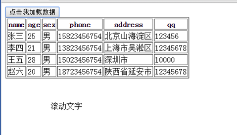
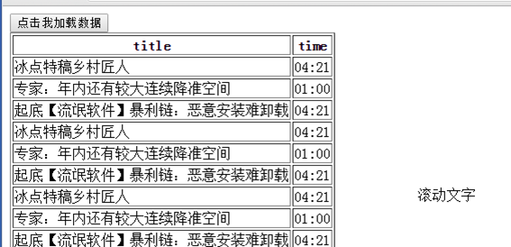
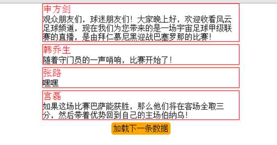
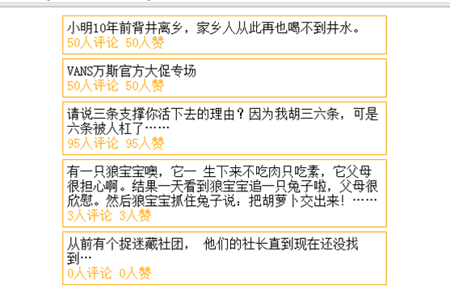

# 大纲 #

1. JSON 
2. AJAX
3. 应用


# ajax #

## 为什么要使用ajax ##

1. 历史： Google Gmail、Facebook、
2. 用户体验好
3. 前端中必须要掌握的技能，应用无处不在

### 作用 ###
允许客户端脚本发送HTTP请求，去请求服务器的数据来创建动态网页，可以在不重新加载整个网页的情况下，对网页的某部分进行更新。也称局部刷新

（常见的例子：分页、用户名即时验证、聊天）；


## 什么是ajax ##

AJAX (阿贾克斯 Asynchronous Javascript And Xml ) 异步JavaScript和XML，是指一种创建交互式网页应用的网页开发技术, 可以访问服务器数据的局部刷新的技术。

AJAX不是一种新的编程语言，而是一种用于创建更好更快以及交互性更强的Web应用程序的技术。

** AJAX的核心是 JavaScript对象XMLHttpRequest **。它是一种支持异步请求数据的技术。

## JSON ##

JSON(JavaScript Object Notation) 是一种轻量级的数据交换格式。 通过JavaScript中的一些模式来表示结构化数据, JSON 并不是 JavaScript 独有的数据格式，其他很多语言都可以对 JSON 进行解析和序列化,  
除了JSON外, 还有XML也是一种数据表示方式;

JSON 的语法可以表示三种类型的值：
1. 对象表示法
2. 数组表示法
3. 对象和数组的结合的表示法

### 对象表示法 ###

JavaScript 对象字面量表示法： 
```
var box = {
      name : 'Zhang', 
      age : 100
};

```

JSON

而 JSON 中的对象表示法需要加上双引号，并且不存在赋值运算和分号：
```
{
    "name" : "Zhang",   //需要使用双引号，否则转换会出错
    "age" : 100
}

```

### 数组表示法 ###

JavaScript 数组字面量表示法：
var box = [100, 'Zhang', true];

JSON
而 JSON 中的数组表示法同样没有变量赋值和分号：
[“100”, “Zhang”, “true”]


### 对象和数组结合的复杂形式 ###

一般比较常用的一种复杂形式是数组结合对象的形式：
```
[
      {
            "name" : "a", 
            "age" : 1
      },
      {
            "name" : "b", 
            "age" : 2
      },
]

```


### JSON 的解析 ###


JSON文本形式，并且赋值给变量box。box的值是标准的JSON格式写法, (注意单双引号, 将单引号写在外面, 里面用双引号)
var box = '[{"name" : "a","age" : 1},{"name" : "b","age" : 2}]';


JSON解析就是对JSON格式的字符串解析成原生的JavaScript值(数组或对象)


1. eval()函数. 但这个方法可能会造成安全问题
2. JSON 对象提供了另外两个方法(常用):
JSON.parse(): JSON解析,将JSON字符串转换为JavaScript原生值(对象或数组);
JSON.stringify() : json序列化,将原生JavaScript值(对象或数组)转换为JSON字符串的过程;


## XMLHttpRequest ##

Ajax 技术核心是 XMLHttpRequest 对象(简称 XHR)。
XHR 的出现，提供了向服务器发送请求和解析服务器响应流畅的接口。能够以异步方式从服务器获取更多的信息，这就意味着，用户只要触发某一事件，在不刷新网页的情况下，更新服务器最新的数据。

虽然 Ajax 中的 x 代表的是 XML，但 Ajax 通信和数据格式有关，也就是说这种技术不一定使用 XML。相反目前常用的数据格式是JSON.

XHR对象支持IE7+、Firefox、Opera、Chrome 和 Safari 等浏览器, 但是不支持IE6。


```

创建 XHR 对象可以直接实例化 XMLHttpRequest 。
var xhr = new XMLHttpRequest();
alert(xhr);	//XMLHttpRequest


如果是 IE6 及以下，那么我们必须还需要使用 ActiveX 对象通过 传入参数Microsoft.XMLHTTP来实现。
xhr = new ActiveXObject("Microsoft.XMLHTTP");


```


# 如何写 #

## open()方法:  ##

它接受三个参数：要发送的请求类型(get、post)、请求的 URL 和表示是否异步
xhr.open('get', 'demo.json', false);  //对于demo.json 的 get 请求，false表示同步


## send()方法: ##

向服务器发送请求
open()方法并不会真正发送请求，而是准备好需要发送给服务器的内容。我们需要通过send()方法向服务器发送请求

send()方法接受一个参数，作为请求体发送的数据。如果是get方式请求则填 null。
xhr.send(null);	 


## abort()方法 ##

取消异步请求, 如果需要取消某异步请求, 则在send()之后再调用, 写在send()之前调用会报错

//取消异步请求
xhr.abort();


## XHR 对象的属性: ##


当请求发送到服务器端，收到响应后，响应的数据会自动填充 XHR 对象的属性。一共有四个属性：
```

status: 响应的 HTTP 状态 (重要)
statusText: HTTP 状态的说明 (重要)
responseText:  作为响应主体被返回的文本 (重要)
responseXML: 如果响应主体内容类型是"text/xml"或"application/xml"，则返回包含响应数据的 XML文档,否则是null

```

### status 属性: ###

      HTTP请求状态码, 一般 HTTP 状态代码为 200 则表示请求服务器成功
```
HTTP 协议中， 状态码
   404:  找不到服务器中的资源
   403:  服务器缓存
   500：  服务器故障
   200:  【正常】返回
   400:  语法错误导致服务器不识别
   503:  由于服务器过载或维护导致无法完成请求

```
	
### readyState 属性 ###
```
0:       没有发送
1:       已经发送了，但服务器还没有接收到
2:       服务器已经接收到了，但还没有处理完数据
3:       服务器已经处理完数据，并已经返回
4:       客户端已经正常接收到服务器返回的数据
```


```
// 1. 创建对象
var req = new XMLHttpRequest();

// 2. 准备
		//    参数1： 获取数据的方式， GET、POST
		//    参数2： 向服务器请求数据的地址 格式： 例如：http://ip:8080/ajax/ajaxtest
		//    参数3： false 代表同步的方式请求数据，true 代表异步
		// req.open("GET", "http://127.0.0.1:8080/ajax/ajaxtest", false);
req.open("GET", "http://127.0.0.1:8080/ajax/ajaxtest", false);

// 3. 发送请求
req.send();

// 4. 获取数据
req.onreadystatechange = function() {
	if (req.readyState == 4) {
		if (req.status == 200) {
			// 200 说明返回的数据是正常的
			var str = req.responseText;
		}
	}
}

```

# 应用 #

## 1. 加载人员信息 ##

使用Ajax异步请求person.json数据:
1, 点击按钮加载person.json中的数据并显示在table表格中(默认表格中没有数据, 只有表格标题)
2, 在下方显示一个滚动文字,并让其从右往左滚动



## 2. 加载新闻 ##

1, 将代码写在配置好的服务器中(创建的html文件名使用英文)
2, 将服务器数据也放在配置好的服务器中(可在服务器文件夹下自定义目录存放)

练习: 访问服务器下的数据
      获取接口:http://localhost:8080/json/news中的数据, 并显示如下图



## 3. 加载足球信息 ##
访问服务器数据, 获取接口:http://localhost:8080/json/football中的数据, 并显示, 如下图
1, 默认没有数据, 点击”加载下一条数据”按钮每次加载一条数据,
2, 当数据全部显示后, 点击按钮弹出提示框”数据已经加载完毕”




## 4. 加载足球信息 ##

访问服务器数据, 获取接口:http://localhost:8080/ajax/weibo中的数据, 并显示, 如下图



# 作业 #

重写应用案例
