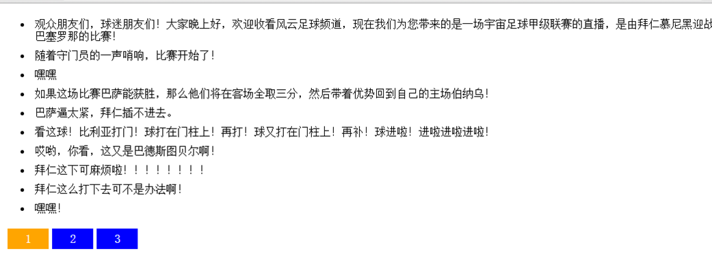

# 大纲 #

1. HTTP协议
2. GET与POST
3. AJAX的封装

# HTTP协议 #
HTTP是一个属于应用层的面向对象的协议, 由于其简捷,快速的方式, 适用于分布式超媒体信息系统.
 
HTTP协议的主要特点有: 
        1, 支持客户端/服务端模式. 即请求(request)-响应(response)模式
        2, 简单快速,  客户端向服务端发送请求时, 只需要传送请求方式和路径即可,所以简单, 由于HTTP协议简单, 使得HTTP服务器的程序规模小, 因而速度很快;
        3, 灵活, 传输数据类型种类多
        4, 无连接,  请求一次服务器后立刻断开连接, 即非长连接, 即短连接
        5, 无状态,  HTTP协议对事务处理没有记忆能力; session


HTTP协议的请求方式: GET, POST, HEAD, PUT等
HTTP包含: 请求头和请求体


# GET请求 #
在通过HTTP协议向服务器请求的过程中，有两种最常用的请求方式，分别是: GET和POST。在Ajax使用的过程中，GET的使用频率又要比POST高得多.
GET请求最常用于向服务器获取数据。也可以将少量字符串参数提交给服务器。
xhr.open('get', 'demo.php?football=1&name=Koo', true);

通过URL后的问号?给服务器传递键值对数据，服务器接收到请求后可以从中获取到对应的数据

---------
练习: 表单验证(在服务端验证)

输入用户名, 通过在服务器验证该用户名是否被注册过:
获取接口:
http://localhost:8080/ajax/checkname
中的数据进行验证,
参数:  regname: 表示用户名;  
返回值说明: 如果返回yes则表示注册过, 如果返回no则表示可以使用.


---------

实现翻页效果

访问服务器数据: 获取接口
http://localhost:8080/ajax/football
中的数据, 并显示如下图,  其中参数为: pageNo, 表示页码(从1开始)





## 字符编码: ##
特殊字符传参产生的问题可以使用encodeURIComponent()进行编码处理，中文字符的返回及传参，可以将页面保存和设置为 utf-8 格式即可.
```

//一个通用的函数给URL添加参数
addURLParam(url, name, value) {
	//判断的 url 是否有已有参数 , 添加?或者&来连接参数
	url += (url.indexOf('?') == -1 ? '?' : '&'); 
	url += encodeURIComponent(name) + '=' + encodeURIComponent(value); 
	return url;
}

```


## 请求头:  ##

请求头包含HTTP的头部信息, 即服务器返回的响应头信息和客户端发送出去的请求头信息。我们可以获取响应头(response)信息或者设置请求头(request)信息。

```
//使用 getAllResponseHeaders()获取整个响应头信息
alert(xhr.getAllResponseHeaders());

//使用 getResponseHeader()获取单个响应头信息
alert(xhr.getResponseHeader('Content-Type'));

//使用 setRequestHeader()设置单个请求头信息 xhr.setRequestHeader('MyHeader', Zhang); //放在 open 方法之后，send 方法之前


```

## POST请求: ##

```
POST 请求可以包含非常多的数据，我们在使用表单提交的时候，很多就是使用的 POST 传输方式。
xhr.open('post', 'demo.php', true);

POST请求向服务器发送的数据，不会跟在URL后面，而是通过 send()方法向服务器提交数据。
xhr.send('name=Zhang&age=100');

POST请求和Web表单提交不同，需要使用 XHR 来模仿表单提交
xhr.setRequestHeader('Content-Type', 'application/x-www-form-urlencoded');
```

从性能上来讲POST请求比GET请求消耗更多一些，用相同数据比较，GET 最多比 POST 快两倍。这也是我们GET请求的使用率大于POST的原因


### GET与POST的对比 ###

```
 共同点： 都是向服务器请求数据的方式
       GET                                                                        POST
   数据放在地址栏后 ?reg=123&psw=123                                           send(数据参数)
   数据量小                                                                      数据量大
   安全性低                                                                      安全性高
   传输速度快                                                                  传输速度慢

```

# AJAX的封装 #

```


// 封装 ajax 请求的函数
//   参数：obj 是一个对象，其中包含如下属性
//      method    请求数据的方式：  GET， POST
//      url       请求数据的地址
//      data      请求的数据， 对象的形式 {regname:123, psw:123}
//      async      true：异步 否则就是同步
//      success   成功的回调函数
//      failture  失败的回调函数
function ajax(obj) {
	
	// 1> 创建
	var req = new XMLHttpRequest();

	// checkname?regname=123&psw=123
	// 说明当前是 GET 方式   toUpperCase 将 method 的值转换成大写形式
	// && data 说明并且有数据
	if (obj.method.toUpperCase() == "GET" && obj.data) {
		obj.url += "?";
		// 调用函数，将对象转换成查询字符串，拼接到 url 中
		obj.url += params(obj.data);
		
	}

	if (!obj.async) {
		obj.async = true; 
	}
	
	// 2> 准备
	// method 是参数1
	req.open(obj.method, obj.url, obj.async);

	// 3> 发送
	if (obj.method.toUpperCase() == "POST") {
		// 发送 POST 数据
		req.setRequestHeader("Content-Type", "application/x-www-form-urlencoded");
		req.send( params(obj.data) );
		
	} else {
		// GET的数据的方式
		req.send();
	}

	// 4> 接收数据
	req.onreadystatechange = function() {
		if (req.readyState == 4 ) {

			if (req.status == 200) {
				obj.success && obj.success(req.responseText);
			} else {
				obj.failture && obj.failture(req.status);
			}
		}
	}
}


// 将对象转换成参数形式
//{regname:123, psw:123}
//checkname?regname=123&psw=123
function params(obj) {

	// 拼接参数的数组
	var arr = [];
	
	for (var key in obj) {
		var str = "";
		
		// 拼接参数值
		str += key;
		str += "=";
		
		// 将这个值 进行转码
		str += encodeURIComponent( obj[key]  );
		
		arr.push(str);
	}
	
	return arr.join("&");
}


```

# 作业 #
1, 将Ajax原理理解, 并掌握如何使用Ajax
2, 理解课堂中所涉及到的服务器的概念, 以及其他概念:  同步,异步, http协议, get和post等..
3, 将课堂案例自己写一遍

